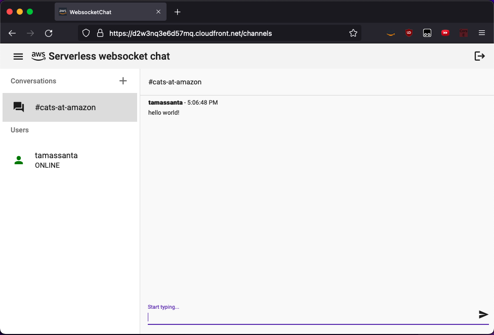
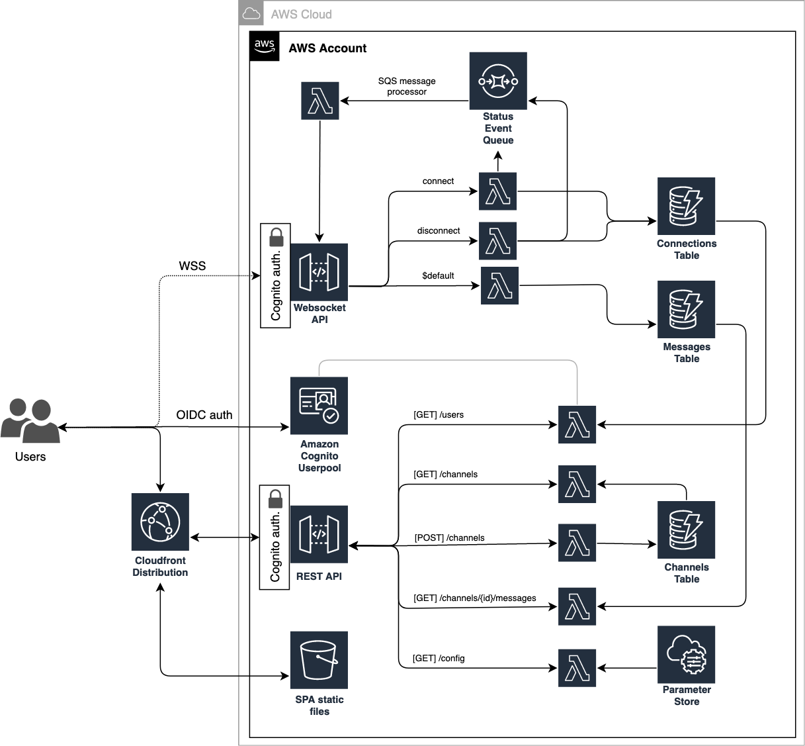
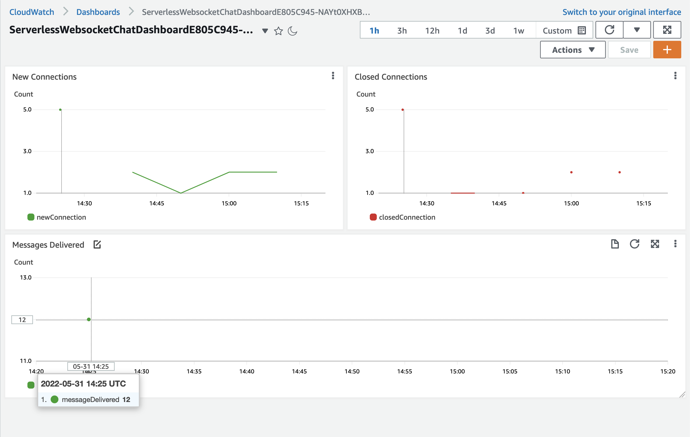
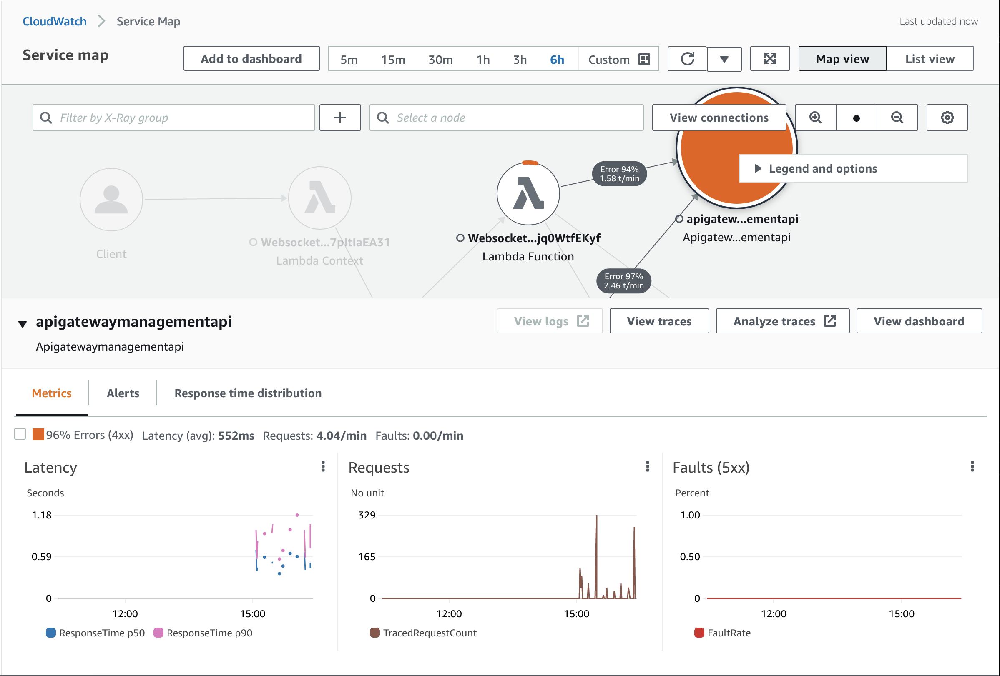

# Serverless chat application using ApiGateway Websockets
This project lets you provision a ready-to-use fully serverless real-time chat application using Amazon ApiGateway Websockets. The infrastructure code is using the [AWS Cloud Development Kit(AWS CDK)](https://aws.amazon.com/cdk/). The frontend is written using [Angular 12](https://angular.io/).



## Features

- [x] "One-click" serverless deployment using [AWS CDK](https://aws.amazon.com/cdk/)
- [x] Infrastructure is split into 6 interdependent stacks (Authorization, Database, REST API, Websocket API, Frontend, Observability)
- [x] Secure HTTPS connection and content delivery using [Amazon Cloudfront](https://aws.amazon.com/cloudfront/)
- [x] Built-in authentication using [Amazon Cognito](https://aws.amazon.com/cognito/)
- [x] Built-in REST API authorization using Cognito UserPool Authorizer
- [x] Synchronous real-time messaging using [API Gateway Websocket API](https://docs.aws.amazon.com/apigateway/latest/developerguide/apigateway-websocket-api.html)
- [x] Asynchronous user status updates using [Amazon SQS](https://aws.amazon.com/sqs/) and API Gateway Websocket API
- [x] Environment-agnostic Single Page Application frontend (dynamic environment configuration loading)
- [x] Complete request tracing using [AWS X-Ray](https://aws.amazon.com/xray/)
- [x] Lambda Powertools integration *(beta)*
- [x] Structured logging and monitoring using [Amazon Cloudwatch](https://aws.amazon.com/cloudwatch/)
- [x] Custom metrics & Cloudwatch dashboard
- [x] Built-in infrastructure security check using [CDK-NAG](https://github.com/cdklabs/cdk-nag)

## Solution Overview


## Project structure
    
    ├── infrastructure                      # Infrastructure code via CDK(Typescript).
    │   ├── bin                             # CDK App - Deploys the stacks  
    │   ├── lib                             #
    |   |   ├── auth-stack.ts               # Contains the Cognito Userpool
    |   |   ├── database-stack.ts           # DynamoDB table definitions
    |   |   ├── frontend-stack.ts           # Cloudfront distribution, S3 bucket for static hosting and additional resources
    |   |   ├── rest-api-stack.ts           # ApiGateway REST API to support the frontend application
    |   |   ├── websocket-stack.ts          # ApiGateway Websocket API for real-time communication
    |   |   ├── observability-stack.ts      # CloudWatch Dashboard with custom metrics
    ├── UI                                  # Angular 12 Single Page Application (SPA)
    └── ...

The `cdk.json` file inside `infrastructure` directory tells the CDK Toolkit how to execute your app.

## Prerequisites

- [AWS CLI](https://aws.amazon.com/cli/) installed and configured with the aws account you want to use.
- [AWS CDK](https://docs.aws.amazon.com/cdk/latest/guide/getting_started.html) installed and configured with the aws account you want to use.
- [docker](https://docs.docker.com/get-docker/) installed and is up and running locally (required for the lambda function builds).
- [Angular CLI](https://angular.io/cli) installed.

## Security considerations
For the sake of this demo, **not all security features are enabled** to save cost and effort of setting up a working PoC. 

Below you can find a list of security recommendations in case you would like to deploy the infrastructure in a production environment:
- Currently **all registered users can immediately access** the application without second factor authentication or account confirmation. This is not suitable for production use. Please change the Cognito configuration to enable e-mail/sms verification and MFA. In a future release this will be addressed with a feature flag to toggle between different authentication modes.
- The DynamoDB tables have no backups configured by default. Please enable PITR (point-in-time recovery) and table backups. The tables will be removed on cloudformation stack deletion.
- Logging for the APIGateway API/stage and for the Cloudfront distribution are disabled. Please enable these additional logs in production environments for audit and troubleshooting purposes.
- The Cloudfront distribution uses the default cloudfront domain and viewer certificate. The default viewer certificate defaults to the TLSv1 protocol. In order to enforce newer protocols, please use a custom domain with a custom certificate and set the MinimumProtocolVersion to TLSv1.2.

## Getting started
### Deployment

- Change directory to where infrastructure code lives.
```bash
    cd infrastructure
```

- Restore NPM packages for the project
```bash
    npm install
```

- Bootstrap your AWS account as it's required for the automated Docker image build and deployment
```bash
    cdk bootstrap aws://{ACCOUNT_ID}/{REGION}
```

- Synthesize the cdk stack to emits the synthesized CloudFormation template. Set up will make sure to build and package 
  the lambda functions residing in the [handlers](/infrastructure/resources/handlers) directory.
```bash
    cdk synth
```

- Deploy the CDK application
```bash
    cdk deploy --all
```

### [Optional] - Building the frontend
- Change directory to where UI code lives.
```bash
    cd UI
```
- Build the frontend application
```bash
    ng build --prod
```

### Opening the chat application
The chat application's URL will be found at the Frontend stack's output. Open the Cloudfront Distribution's URL in your browser, where you'll be redirected to the Cognito login/singup page. 

### Cleanup
Run the following command to delete the infrastructure stacks:
```bash
    cdk destroy --all
```

## Observability
The backend is fully instrumented using AWS Xray and Lambda Powertools for TypeScript (beta).

### Custom Metrics & Cloudwatch Dashboard
The backend outputs 3 custom metrics from the websocket API backend:
* New Connections
* Closed Connections
* Messages Delivered

The [Observability Stack](/infrastructure/lib/observability-stack.ts) creates a custom Cloudwatch Dashboard where these metrics are visualised.



### AWS X-Ray and ServiceMap integration
Requests are automatically traced and instrumented using [AWS X-Ray](https://aws.amazon.com/xray/). You can use the ServiceMap to visualise the interactions between the backend components and trace latencies, response codes, etc. between these components.




## API Handler documentation
You can find a more detailed description of what the API handler functions are doing [here](/infrastructure/resources/handlers/README.md).

## Found an issue? Anything to add?
See [CONTRIBUTING](CONTRIBUTING.md#security-issue-notifications) for more information.

## License

This library is licensed under the MIT-0 License. See the LICENSE file.
